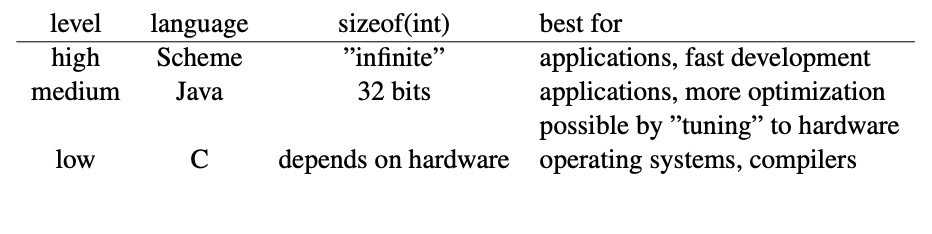

# C Intro: Pointers & Array

## Table of Contents 
   1. [61C from a 61A perspective](#first)
   2. [C as a Low-Level Language](#second)
   3. [C Pitfalls](#third)
   4. [Storage Classes](#fourth)
   5. [The main() Procedure](#fifth)
   6. [Arrays and Pointers](#sixth) 

### **61C from a 61A Perspective**
Just as in the case of software, computer hardware developers with the idea of abstraction to enable greater complexity and generality. 
- Digital Domain: There's abstraction at work within hardware deisgn itself. Fanouts are the number of circuits that can be allowed to read a given circuit's output before votalge reading might interpret it as a low voltage happens. In the digital abstraction, we pretend there are no intermediate voltages, and we think about fanout contraints seperactely. 
- An Example: Number Representations 
  - Consider the history of number representation. Some earlier computers used a different representation than binary (in which each bit represents a power of two). It was called BCD (Binary Coded Decimal). In this system, each decimal digit of a human-readable numeral is directly encoded using four bits 
  - For example, Integer 2479 would be represented as: 0010 0100 0111 1001 
  - Each group of four is a smaill unsigned binary integer. 
  - What was the point of this representation? BCD computers existed at the same time as other computers that used binary, and the circuiry to perform arithmetic operations on BCD numbers is much more complicated than the circutiry used for binary artihmetic. And binary representation cannot exactly represent the fraction 1/10. That's why business users didn't like the idea of binary computers; they were afraid of roundoff errors. Consider bank interest.
  - Today, no need to represent numbers in binary form. The general principle of abstraction takes the specific form of moving a task from hardware (a low level of abstraction) to software (a higher level). 
  - RISC (Reduced Instruction Set Computing) approach to computer design depends on many instaces of the same idea. 
- **The Stored Program Computer** 
  - From 61A, metacircular evaluator was viewed as a universal program. Such as x -> 3x +5 would be `(lambda  (x) (+ (+ 3 x) 5))`
  - Stored Program: Instead of representing the problem to be solved in the circuitry of the computer, you represent the problem *as data* in the computer's memory, and what you put in the circuitry is the algorithm by whic hthat representation (called a machine language program) is interpreted.The central processor of a modern computer is, therefore, exactly analogous to the metacircualr evaluator.

### **C as a Low-Level Language** 
- Some languages are "high-level" while others are more "low-level." High-level and low-level both refer to compiled and interpreted languages. 
  - *"High-level" is not a compliment, and "low-level" is not an insult.* They are used for different purposes.
  
  - Low-level is concerned with tasks in which kowledge of the hardware is part of the problem itself: operating systems and compilers. 
  - This is why 61C is MOST IMPORTANT for 162 (OS), 152 (Architecture) and 164 (Compilers). 
  - Overflow: the fact that some arithmetic computations produce answers that are not representable in the particular encoding that the computer uses for numeric values. 
  - 2^10 = 1024 ~= 1000 
    - 2^15 = 2^5 * 2^10 ~= 32 thousand 
    - 2^16 = 2^6 * 2^10 ~= 64 thousand 
    - 2^32 = 2^2 * 2^10 * 2^10 * 2^10 ~= 4 billion 
    - Each 2^10 corresponds to one of the three-digit groups ordinarily separate by commas in human-readable numerals, so in the last example above you think "thousand, million, billion. 

### C Pitfalls

### Storage Classes 

### The Main() Procedure

### Arrays and Pointers