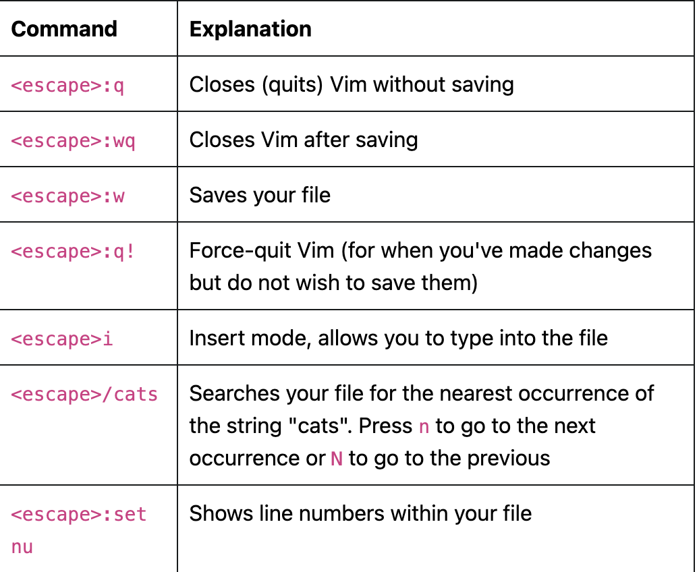

# Lab 0 Note

## Table of Contents 
- [Lab 0 Note](#lab-0-note)
  - [Table of Contents](#table-of-contents)
    - [SSH and SCP](#ssh-and-scp)
    - [Vim Basics](#vim-basics)
    - [Testing Setup](#testing-setup)
    - [git](#git)
    - [fizzbuzz](#fizzbuzz)
### SSH and SCP
- To SSH into hive server
  - `ssh cs61c-???@hive#.cs.berkeley.edu`
- scp: Secure Copy - To get individual files or entire folders from the hive machines onto your local system, or vice versa
  - `scp <source> <destination>`
  - Copying a file: scp cs61c-???@hive3.cs.berkeley.edu:~/some-folder/example.txt ~/Downloads/
  - Copying a folder: scp -r cs61c-???@hive5.cs.berkeley.edu:~/some-folder ~/Downloads/

### Vim Basics 
- To open a file from your current directory 
  - `vim filename`
  - `vim ../other-folder/filename` for opening a file from another directory. 
  - 
  - `set mouse=a` for enabling your mouse 
  - `set number` for enabling line numbers 
  - [Vim for CS61C guide](https://docs.google.com/document/d/1WQF6hQK8CXtlGynSAIX7Rts6q8lykarrqX-zkb9ZDyc/view)

### Testing Setup 
- To test your GUI environment: `java -jar logisim-evolution.jar # replace the filename with the one you downloaded` 
- To test your CLI environment: 
```
git --version
python3 --version
gcc --version
java -version
```

### git 
- Added remote for starter code: `git remote add starter https://github.com/61c-teach/fa21-lab-starter.git`
- To dupate starter code: `git pull starter main`
- Setting up for lab00 exercise: `git fetch --tags --force starter && bash setup.sh`
- 

### fizzbuzz 
- Fixed merge conflict
  - git push didn't work because the current branch is behind its remote counterpart -> had to git pull -> merge conflict ->fix merge conflict -> git add, commit, push worked 
```
   def fizzbuzz(num):
  if multiple of 15:
    print num: fizzbuzz
  elif multiple of 3:
    print num: fizz
  elif multiple of 5:
    print num: buzz
```
